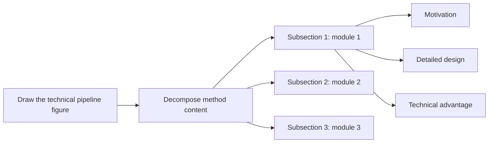

# Design Writing Guide

## Goal

Describe the system architecture and component-level design decisions clearly, so readers can understand and reproduce the system. In a paper where Method is split into motivation, challenges, and design, this section carries the solution logic.

## Role in the Method Section

Design should answer the question that Motivation and Challenges leave open: given the problem and the obstacles, what exactly is the system and why does it work?

## Pre-Writing Questions

Answer these before writing:

1. What modules exist in the method?
2. For each module, what is the workflow, why is this module needed, and why does this module work?
3. What are the major components or layers of the system?
4. For each component, what does it do, why is it needed, and why is this design better than alternatives?
5. What is the end-to-end I/O path for the key operations, such as write path, read path, compaction, or recovery?
6. What are the key data structures and their properties?
7. What invariants does the system maintain, and how?

## Design Writing Steps

1. Draw a system architecture or pipeline sketch with components, data flows, and I/O paths.
2. Use the sketch to organize Design subsections, one subsection per major component or design decision.
3. For each subsection, plan three parts: motivation, component design, and design rationale.
4. Write component design first to build a concrete backbone.
5. Add motivation and design rationale afterward.

## Three Elements of a Design Component

### 1) Component Design

1. Describe data structures, on-disk or in-memory layout, or protocol details.
2. Describe the operation flow: given input, step 1, step 2, step 3, output.
3. State the invariants maintained by this component.

### 2) Motivation of This Component

1. Identify which challenge from the Challenges section this component addresses.
2. Use problem-driven logic: because challenge X exists, we design component Y.

Typical opening sentences:

1. A key challenge is ...
2. To address C2, we design ...
3. Existing approaches fail to handle ... because ...; therefore, we introduce ...

### 3) Design Rationale

1. Explain why this design is better than the most natural alternative.
2. Tie the rationale to measurable properties such as write amplification, lock contention, or cache efficiency when possible.
3. State tradeoffs explicitly: what does this design give up, and why is that acceptable?

## Method-Level Planning Checklist

Before drafting the body text, answer the following three questions for each subsection:

1. What module or component does this subsection cover?
2. What is the exact forward process from input to output?
3. What technical advantage does this design give over alternatives?

This is the same planning logic as the triad used in module-level writing: design first, then motivation, then rationale.

## How to Write Module Design

Module design usually has two parts: first describe the specific data or network structures, then describe the forward process as input to steps to output.

Writing structure:

1. Define key structures first, such as the representation, network, or data structure.
2. Write the forward process in strict execution order.
3. End with output interpretation or purpose.

Sentence skeleton:

1. We represent ... with ...
2. Given [input], we first ... then ... finally ...
3. This produces [output], which is used for ...

## How to Write Module Motivation

Module motivation is usually problem-driven: because a problem exists, we design module Y to solve it.

Typical opening sentences:

1. A remaining problem or challenge is ...
2. However, we ...
3. Previous methods have difficulty in ...

Usage note:

1. State the specific failure before introducing the module.
2. Keep motivation independent from implementation details.

## Section Structure

```latex
\section{Method}
% Overview
% Section 3.1
% Section 3.2
% Section 3.3
```

## Overview Subsection

Overview should usually include setting, core contribution, optional pipeline figure pointer, and a map of what each subsection contains.

Writing structure:

1. One to two sentences for task setting.
2. One to two sentences for core contribution.
3. If the pipeline or framework is novel, point to the overview figure.
4. Tell readers what Section 3.1, 3.2, and 3.3 cover.

Typical structure in prose:

1. We consider [setting].
2. To address the challenges above, we propose [core idea].
3. Figure X gives an overview of the pipeline.
4. Section 3.1 describes ..., Section 3.2 introduces ..., and Section 3.3 presents ....

## Operation Flow Description

Write the key operation paths step by step:

1. When a write arrives, the system first ... then ... finally ...
2. On a read, [component] checks ... If [condition], ... otherwise ...
3. During recovery, the system replays ... up to the last consistent checkpoint.

## I/O and Data Structure Naming

1. Name all data structures on first use, such as the sorted string table (SST).
2. Use consistent names throughout; never switch between synonyms.
3. Distinguish in-memory structures from on-disk structures explicitly.

## Module Writing Pattern

For each module subsection, follow this order:

1. State the module motivation or the challenge it addresses.
2. Define the module design, including the representation or data structure.
3. Describe the forward process from input to output.
4. Explain the technical advantages and verifiable gains.

## Method Content Decomposition



## Design Section Skeleton

```text
Overview
Component 1: motivation, design, rationale
Component 2: motivation, design, rationale
Component 3: motivation, design, rationale
Implementation details
```

## Implementation Details

Include near the end of Design or in a dedicated subsection:

1. Programming language and key libraries.
2. Configurable parameters, such as block size, buffer pool size, or compaction trigger threshold.
3. Thread or process model and synchronization primitives used.
4. Hardware assumptions such as NVMe queue depth, DRAM capacity, or network bandwidth.

## Design Quality Checklist

1. Can a reader reproduce the system from the Design section alone?
2. Is every design decision connected to a challenge from the Challenges section?
3. Are all data structures and I/O paths described precisely?
4. Are design tradeoffs explicitly stated?
5. Is terminology stable and consistent throughout the section?
6. Is there an architecture figure that matches the text?
7. Does each subsection clearly separate motivation, design, and rationale?
