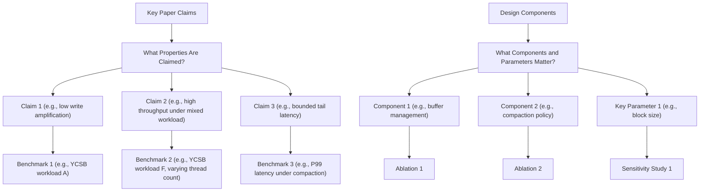
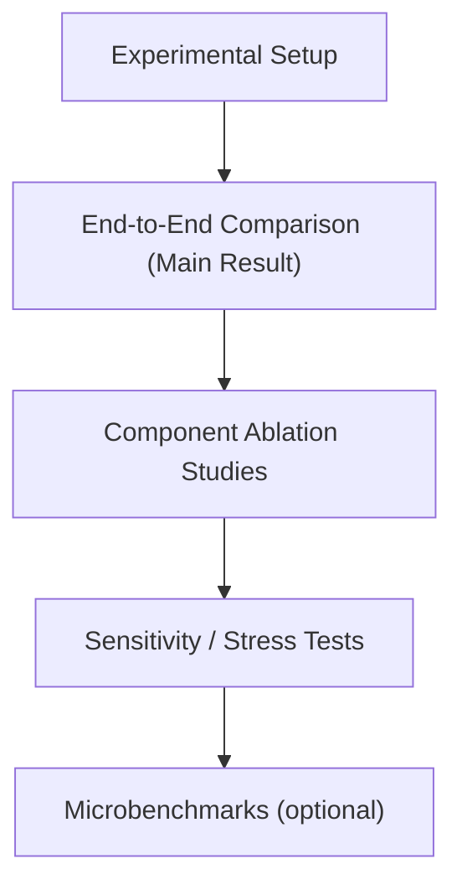

# Evaluation Writing Guide

## Goal

Convince reviewers with complete, reproducible evidence that the system achieves its claimed performance, correctness, and practical value.

## Three Core Questions

1. Does the system outperform strong baselines on the target workloads?
   - Run comparisons against strong and recent baseline systems under the same hardware and software configuration.
   - Report standard metrics: throughput (ops/sec or MB/s), latency (median, P99, P999), write/read/space amplification.
   - Include state-of-the-art or strongest public systems; do not cherry-pick weak baselines.
   - Keep the evaluation protocol fair (same hardware, same dataset, same configuration knobs).
2. Which design decisions are responsible for the gains?
   - Run ablation experiments: disable, replace, or remove each key component and report the delta.
   - Cover every component or design choice claimed as a contribution.
   - Show component interaction when two components are coupled.
3. How does the system behave under stress and at the boundaries of its claims?
   - Test under adversarial or out-of-distribution workloads (skewed key distributions, large value sizes, mixed read/write ratios, high concurrency).
   - Report failure modes and degradation curves, not just peak numbers.
   - Evaluate crash-recovery correctness if durability is claimed.

## Evaluation Planning

## Evaluation Section Structure

## Experimental Setup Subsection

State clearly:

1. Hardware configuration (CPU, DRAM, storage device model, network).
2. Software stack (OS, kernel version, filesystem if relevant).
3. Workload suite (YCSB, TPC-C, FIO, application trace) and parameter settings.
4. Baseline systems and their versions and configurations.
5. Metrics reported and their definitions (e.g., "throughput: committed operations per second measured at the client").

## Standard Storage System Benchmarks

1. **YCSB** (Yahoo! Cloud Serving Benchmark): workloads A–F cover write-heavy, read-heavy, read-modify-write, and scan patterns.
2. **TPC-C**: OLTP transaction benchmark for key-value or relational storage engines.
3. **FIO**: flexible I/O tester for raw device or filesystem throughput and latency characterization.
4. **RocksDB benchmarks (`db_bench`)**: standard microbenchmarks for LSM-tree-based engines.
5. **Application traces**: replaying production workloads from industry or open datasets.

## Key Storage Metrics

1. **Throughput**: operations per second or MB/s sustained over a benchmark window.
2. **Latency**: report at minimum median (P50), P99, and P999; include tail latency under compaction or GC pressure.
3. **Write Amplification Factor (WAF)**: bytes written to device / bytes written by application.
4. **Read Amplification Factor (RAF)**: I/O operations per logical read.
5. **Space Amplification Factor (SAF)**: bytes on device / bytes of live data.
6. **Recovery time**: time to reach a consistent state after a crash.
7. **CPU and memory overhead**: relevant when the system targets resource-constrained environments.

## Figure/Table Writing Rules

`Good tables communicate results precisely; they are not decoration.`

### Hard rules

1. Put caption above the table.
2. Avoid vertical lines in tabular columns.
3. Use `booktabs` style (`\toprule`, `\midrule`, `\bottomrule`).
4. Highlight best results per metric column with bold or subtle color; do not color every cell.
5. State metric direction in column headers (e.g., `Throughput (Mops/s) ↑`, `WAF ↓`, `P99 Latency (ms) ↓`).

### Readability rules

1. Add units in column headers; never require readers to guess.
2. Keep numeric precision consistent within a metric column.
3. Group multi-workload or multi-device results with `\multicolumn` + `\cmidrule`, not vertical separators.
4. One table, one message: do not merge unrelated results.
5. Keep captions focused on setup and protocol; move discussion to the body text.

## Evaluation Rigor Checklist

1. Is each claimed property (throughput, latency, amplification) covered by at least one experiment?
2. Are baselines recent, representative, and configured fairly?
3. Is every key design component covered by an ablation?
4. Are claims in Abstract/Introduction and Motivation supported by reported numbers?
5. Are hardware and software configurations documented precisely enough to reproduce results?
6. Are failure modes and limitations of the evaluation scope stated honestly?
7. Is tail latency reported (not just average) for latency-sensitive claims?
